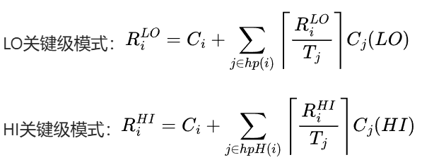

# Response-Time Analysis for Mixed Criticality Systems

## 一、前提知识

1. 什么是混合关键系统？

系统中包含了具有不同关键性级别的任务。在这种系统中，并非所有任务都具有相同的关键性，而是存在多种关键性级别共存的情况。在混合关键系统中，不同关键性级别的任务需要根据其关键级别来进行调度和资源分配，以确保高关键性任务能够优先得到执行，同时也尽量满足低关键性任务的需求。

2. 本文需要解决的问题

- 对包含不同关键级别任务的混合关键级系统进行静态调度分析和运行时监测
- 为混合关键级系统提供一种新的固定优先级单处理器调度实现方案，包括最优优先级分配和充分的响应时间分析

3. 本文的核心思想

* 可调度的概念：对于一个混合关键级系统中的任务集合，如果存在一种优先级分配方案和调度策略，使得无论在何种情况下，每个任务的实际执行时间都不会超过其截止日期，那么就可以说这个任务集合是可调度的。
* **主要解决方案**：提出分区关键级（PC）、静态混合关键级（SMC）和自适应混合关键级（AMC）三种优先级分配方案，其中SMC和AMC利用执行时间监测来提高可调度性，允许不同关键级别的任务优先级交错。

---

## 二、分区关键性-PC

1. 优先级**分配依据** ：根据任务的关键级别（criticality level）进行优先级分配。如果任务τ1的临界级别L1高于任务τ2的临界级别L2，那么τ1的优先级高于τ2。
2. 关键级别内的优先级 ：在同一个临界级别内，按照标准的最优方案进行优先级分配，例如期限单调优先级分配（deadline monotonic priority assignment）。对于具有约束截止日期（即相对截止日期不大于周期：D ≤ T）的任务，这种分配方式是最优的。
3. 优点 ：低临界级别的任务中的定时错误（执行时间超过其代表的“最坏情况执行时间”）不会影响到任何高临界级别的任务。因为低临界级别的任务不会干扰高临界级别任务的执行，所以在这种情况下不需要进行运行时监测。
4. 缺点：PC方案相对较为简单地根据临界级别分配优先级，没有充分利用执行时间监测等功能来进一步优化调度和提高系统的可调度性。

## 三、静态混合关键性-SMC

1. **任务执行限制** ：所有任务可以执行到其代表执行时间Ci，但如果超过这个时间，任务会被阻止继续执行。具体的处理方式可能是任务被中止或重新调度，直到它可以安全地再次执行。
2. **调度分析** ：

* **与分区关键性性(PC)的区别** ：混合关键性性与分区关键性性的区别在于，前者通过优化任务的**时间特性**而非重要性参数来获得可调度性。
* **响应时间分析** ：对于常见的截止时间单调优先级分配方案，关键的操作参数优先级（P）仅由任务的截止日期决定。对于混合关键系统，这可能导致任务受到具有更高优先级但更低关键级级别的任务的干扰（称为关键级反转）。为了测试可调度性，使用标准的响应时间分析（RTA）方法：`首先计算每个任务的最坏情况完成时间（即响应时间R），然后将其与任务的截止日期D进行比较（即测试Ri ≤ Di对于所有任务τi）。响应时间的值通过以下公式计算（其中hp(i)表示优先级高于任务τi的任务集合）：`
  
  

3. 根据任务τj与τi的关键级别关系，确定Cj的值。具体分为三种情况：

* 如果Li = Lj，即任务处于相同的临界级别，则使用正常的代表值Cj。
* 如果Li < Lj，即τi的临界级别低于τj，则使用与τi临界级别对应的Cj(Li)值，因为这是保证该任务所需的级别。
* 如果Li > Lj，即存在临界性反转。使用Cj，但运行时系统必须确保τj的执行时间不超过这个值。

4. **响应时间方程改写**：

5. **优先级分配** ：

* **Vestal的方法** ：Vestal展示了期限单调优先级分配对于具有多个“最坏情况执行时间”的任务不是最优的。因此，SMC通过应用Audsley的优先级分配算法来分配优先级。
* **示例说明** ：以一个包含三个任务的任务系统为例，说明了如何确定某个任务是否可以被分配最低优先级。具体来说，根据公式计算任务的最坏情况响应时间，如果该响应时间不超过任务的截止日期，那么该任务就可以被分配最低优先级。否则，该任务系统可能无法按照SMC方案进行调度。
* **运行时复杂性** ：对于混合临界系统，使用Audsley的算法可以将找到最优优先级顺序的复杂性从n!降低到n(n+1)/2次可调度性测试。此外，对于所有任务满足D ≤ T的情况，优先级分配问题更加直接，在确定是否可以将某个任务分配最低优先级时，只需要考虑低临界级别任务中相对截止日期最大的和高临界级别任务中相对截止日期最大的这两个潜在候选者。这意味着总共只需要进行2n-1次测试，相比于一般与Audsley算法兼容的系统所需的n(n+1)/2次测试，复杂性更低。

## 四、自适应混合临界性-AMC

1. 算法概述
   
   - **关键级别指示器**：使用一个关键级别指示器Γ，初始化为LO
   - **任务调度规则** ：
     - R1：当Γ等于LO时，在每个时刻选择具有最高优先级的等待任务执行
     - R2：如果当前执行的任务在其LO关键级别的WCET内完成执行且未发出完成信号，则Γ切换为HI
     - R3：一旦Γ等于HI，关键级别为LO的任务将停止执行，此后每个时刻选择具有最高优先级的HI关键级任务执行。
     - R4：R5：另外，可以指定Γ重置为LO的情况。例如，如果在某个时刻没有HI关键级任务处于活动状态，则Γ可以重置为LO。
2. 响应时间分析
   
   - **分析阶段** ：AMC的响应时间分析分为三个阶段，与系统模式变化的分析类似。
   - **稳定模式分析**：
     对于稳定模式（LO和HI关键级模式），可以使用标准的响应时间分析，如以下公式：
     其中，hp(i)是所有优先级高于任务τi的任务集合，hpH(i)是HI关键级任务中优先级高于或等于任务τi的集合。

3. **关键变化分析**：
   通过一个具体的任务集示例来说明关键变化分析的复杂性。在该示例中，关键变化可能由任务τ2在执行1个时间单位（未发出完成信号）时触发，且在其前5次释放中的任意一次（如时间0、10、20、30或40）都可能引发关键变化。对这些释放情况进行测试，发现时间40的释放情况最糟糕。如果τ2的最后一次释放延迟4个单位，那么τ1将多执行两次，导致任务τ3在关键变化期间的响应时间发生变化。
4. **充分分析方法**
   将  中的两个关键级别分开考虑。
   修改为
   
   其中R∗i表示在关键变化期间的响应时间。这种分析方法被标记为AMC - rtb（用于响应时间边界）
5. **优先级分配算法**：论文中同样证明，Audsley算法仍然适用AMC算法

## 五、SMC和AMC的对比

1. 任务执行限制：
   前者对所有任务可执行到其代表执行时间 Ci，超过后会被中止或重新调度。而后者若任何任务（来自任何任务τa）执行超过 Ca(LO)，则所有 LO - 关键级任务都会被重新调度。
2. 对关键级任务的处理：
   - 对LO-级别的处理： 
     SMC：若 LO - 关键级任务τl 执行超过 Cl(LO)，则会被重新调度。
     AMC：只要有任何任务执行超过 Ca(LO)，所有 LO - 关键级任务都会被停止执行。
   - 对HI-级别的处理：
    SMC：若 HI - 关键级任务（τh）执行超过 Ch(LO)（但不超过 Ch(HI)），LO -关键级任务继续执行，但可能错过截止日期。
    AMC：在相同情况下，LO - 关键级任务会停止执行，HI - 关键级任务继续满足其截止日期。
3. 响应时间分析：
    SMC 的响应时间分析需要考虑三种情况，根据任务的临界级别关系确定 Cj 的值来计算响应时间。
    AMC 的响应时间分析分为三个阶段，包括验证 LO - 关键级模式、HI - 关键级模式和关键变化本身的可调度性，并且有两种充分分析方法，其中方法 2 比 SMC 的分析更复杂但也更精确。
4. 优先级分配：
   两者都通过应用 Audsley 的优先级分配算法来确定优先级，但 AMC 是 SMC 的扩展，期限单调优先级排序不再是最优的。