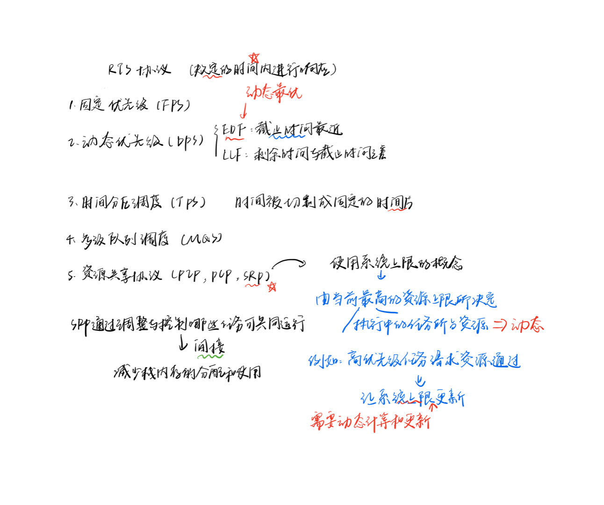

# Stack-based Scheduling of Realtime Processes

## 一、概述
论文探讨了实时系统中的栈式调度策略，尤其是优先级天花板协议（PCP）的应用和扩展。这种策略用在提高系统的调度效率和解决优先级倒置问题。

## 二、主要内容

通过删除多单元资源并定义堆栈资源策略来针对操作系统实现（如在 MarteOS 中）进行优化，如下所示

- 所有任务都被分配了一个抢占级别，以便在锁定资源时保持任务彼此之间的顺序。相对截止时间最低的任务被分配了最高的抢占级别。
- 每个共享资源都有一个关联的上限级别，即访问此受保护对象的所有任务的最大抢占级别。
- 在任何时刻，系统上限都是系统内当前正在执行的所有任务的最大活动优先级。
- 只有当任务的绝对截止时间小于当前正在执行的任务，并且其抢占级别高于当前系统上限时，才允许抢占系统。

